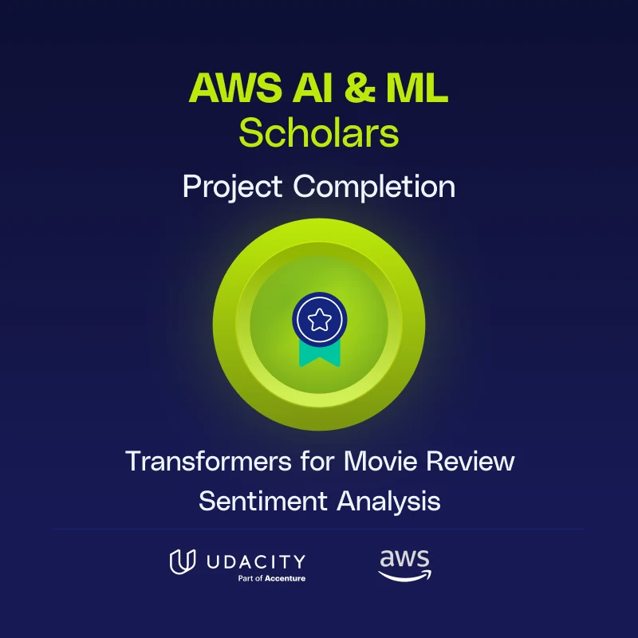

# Future AWS AI Scientist - Project Summary

AWS AI/ML Scholar 2025

Udacity Credentials:  
- [AI Programming Nanodegree Certificate](https://www.udacity.com/certificate/e/aaa90186-2dce-11ef-889a-97c882f2afe3)
- [Future AWS AI Scientist Nanodegree](https://www.udacity.com/certificate/e/7af4eb38-8144-11f0-bd53-e3a8d6b40aa5)

---

## Projects

### Dog Breed Classifier with VGG  
Repository: [Udacity-Use-a-Pre-trained-Image-Classifier-to-Identify-Dog-Breeds](https://github.com/niloydebbarma-code/Udacity-Use-a-Pre-trained-Image-Classifier-to-Identify-Dog-Breeds)  
Udacity AI Programming Nanodegree, July 2024

- Pre-trained VGG model for dog breed classification.
- 100% accuracy for dog vs. non-dog detection.
- 93.3% accuracy for breed classification.
- Includes image preprocessing, label extraction, command-line argument support, and batch model evaluation.

---

### Movie Review Sentiment Analysis  
Notebook: [`Transformers_for_Movie_Review_Sentiment_Analysis--niloy-deb-barma.ipynb`](Transformers_for_Movie_Review_Sentiment_Analysis--niloy-deb-barma.ipynb)

- Binary sentiment classification with transformer models (PyTorch, HuggingFace).
- Final test accuracy: 76.97%.

---

## Methods

- PyTorch datasets and data loaders
- Transfer learning (VGG)
- Transformers for NLP classification
- Training and evaluation workflows
- Data preprocessing pipelines
- Command-line argument support

---

## References

- [AI Programming Nanodegree Certificate](https://www.udacity.com/certificate/e/aaa90186-2dce-11ef-889a-97c882f2afe3)
- [Future AWS AI Scientist Nanodegree Certificate](https://www.udacity.com/certificate/e/7af4eb38-8144-11f0-bd53-e3a8d6b40aa5)
- [Dog Breed Classifier Repository](https://github.com/niloydebbarma-code/Udacity-Use-a-Pre-trained-Image-Classifier-to-Identify-Dog-Breeds)
- [Movie Review Sentiment Analysis Notebook](Transformers_for_Movie_Review_Sentiment_Analysis--niloy-deb-barma.ipynb)
